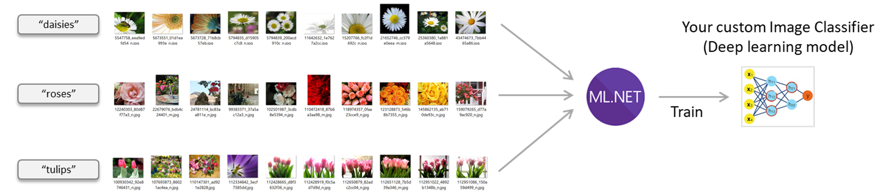
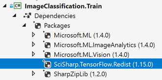
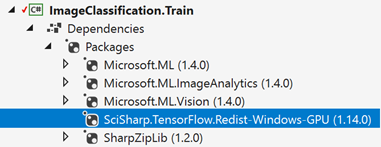

# FlowerImageClassification
Classify and recognize flower images using ML.NET library

This solution based on DeepLearning_ImageClassification_Training, https://github.com/dotnet/machinelearning-samples/tree/master/samples/csharp/getting-started/DeepLearning_ImageClassification_Training

## Bảng thông tin tóm tắt
| ML.NET version | API type          | Status                        | App Type    | Data type | Scenario            | ML Task                   | Algorithms                  |
|----------------|-------------------|-------------------------------|-------------|-----------|---------------------|---------------------------|-----------------------------|
| Microsoft.ML 1.5.2 | Dynamic API | Up-to-date | Console apps, Web App (MVC) and Library in .NET Core | Image files | Image classification, Multiclass classification | Image classification with TensorFlow model retrain based on transfer learning  | DNN architectures: ResNet, InceptionV3, MobileNet, etc.  |

## Vấn đề
Phân loại hình ảnh là một bài toán thường thấy trong lĩnh vực *Học Sâu*. Dưới đây trình bày cách tạo một mô hình phân loại hình ảnh tuỳ biến dựa trên cách tiếp cận *chuyển giao học tập*.

*Kịch bản phân loại hình ảnh, sử dụng thư viện ML.NET xây dựng mô hình học sâu tuỳ biến*

## Tập dữ liệu (Dataset/Imageset)
Bạn có thể sử dụng nhiều tập hình ảnh hoa khác nhau, chẳng hạn tập hình ảnh nổi tiếng Oxford Flower Dataset của Maria-Elena Nilsback và Andrew Zisserman
:
* [17 category dataset](https://www.robots.ox.ac.uk/~vgg/data/flowers/17/index.html): Tập hình ảnh này có 17 loài hoa với 80 hình ảnh của mỗi loài, là những loài hoa phổ biến ở Vương quốc Anh.

* [102 category dataset](https://www.robots.ox.ac.uk/~vgg/data/flowers/102/index.html): Tập hình ảnh này có 102 loài hoa với từ 40 - 258 hình ảnh của mỗi loài, là những loài hoa phổ biến ở Vương quốc Anh.

*2 tập hình ảnh trên chứa các ảnh có nhiều biến thể (ảnh sáng, tỷ lệ, hình dáng) nên nhiều ảnh trong đó trông khác biệt với các hình còn lại.*

Để sử dụng trong dự án này, bạn cần phải đưa các hình ảnh vào đúng thư mục với tên thư mục như là tên lớp (Name as label/category). Tôi đã sắp xếp chúng, bạn có thể sử dụng từ liên kết [này](https://github.com/quocthang0507/ImageClassificationExample/tree/master/jpg) (cho tập 17 category) hoặc từ liên kết [này](https://github.com/quocthang0507/102-Category-Flower/tree/master/jpg) (cho tập 102 category).

Tensoflow cũng cung cấp một tập hình ảnh, bạn có thể tải từ liên kết [này](http://download.tensorflow.org/example_images/flower_photos.tgz).

> *Giấy phép tập hình ảnh*
>
> All images in this archive are licensed under the Creative Commons By-Attribution License, available at:
https://creativecommons.org/licenses/by/2.0/
>
> Thông tin đầy đủ giấy phép được cung cấp trong tập tin LICENSE.txt trong tập tin nén .zip tải về.

## ML Task - Phân loại hình ảnh

Để giải quyết bài toán này, đầu tiên sẽ xây dựng mô hình Học Máy. Sau đó, chúng ta đào tạo mô hình trên dữ liệu sẵn có, đánh giá kết quả và cuối cùng là sử dụng mô hình xây dựng được để phân loại một hình ảnh mới.

### 1. Cấu hình dự án để sử dụng GPU hoặc CPU

Bạn có thể sử dụng sức mạnh sẵn có của máy tính, bạn có thể cấu hình để việc đào tạo sử dụng CPU hoặc GPU. Mặc định, dự án này sử dụng CPU, vì yêu cầu GPU hơi chút khó khăn do bạn phải có một card màn hình tương thích (chẳng hạn NVIDIA GPU graphics cards).

#### Sử dụng CPU

Bạn cần tham chiếu đến thư viện: `SciSharp.TensorFlow.Redist`

#### Sử dụng GPU

Bạn cần tham chiếu đến thư viện: `SciSharp.TensorFlow.Redist-Windows-GPU` hoặc `SciSharp.TensorFlow.Redist-Linux-GPU`

