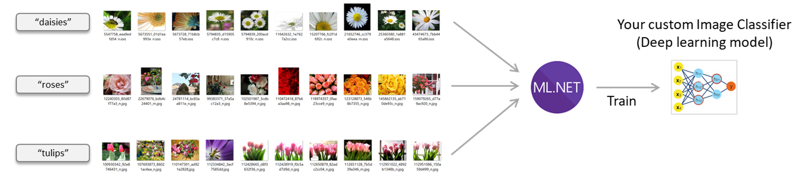
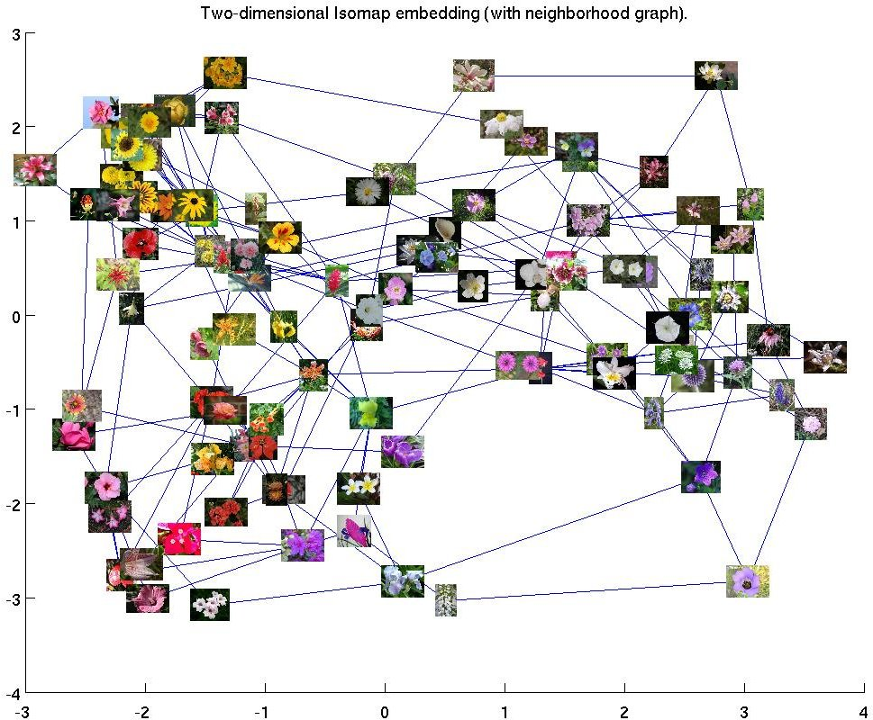
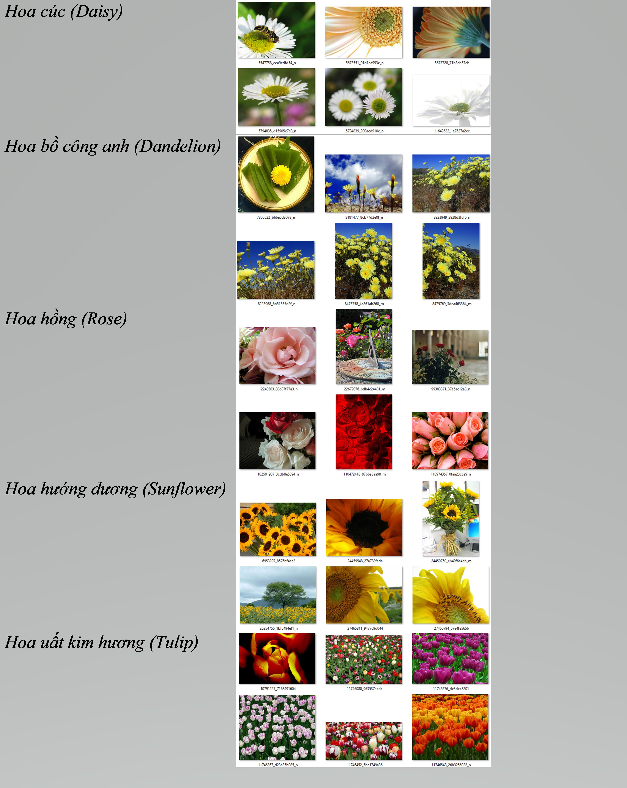
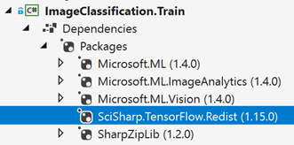
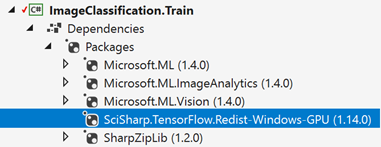
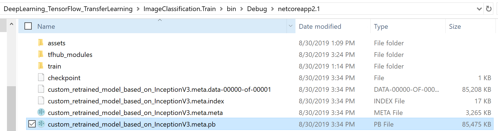
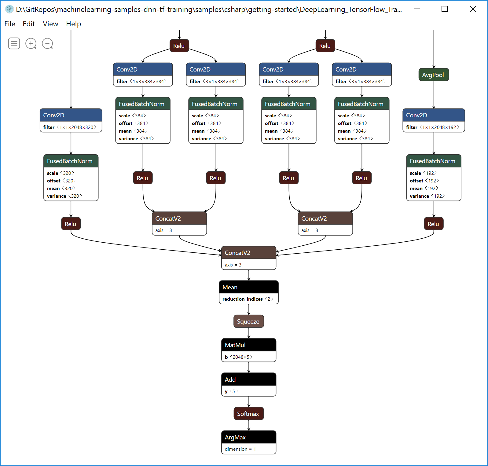

# FlowerImageClassification

| Tên khóa luận | Loại khóa luận | Giảng viên hướng dẫn | Sinh viên thực hiện | Lớp |
| --- | --- | --- | --- | --- |
| Xây dựng ứng dụng nhận diện loài hoa sử dụng thư viện ML.NET | Khoá luận tốt nghiệp kỹ sư Công nghệ Thông tin | TS. Trần Ngô Như Khánh | 1610207, La Quốc Thắng | CTK40 |

*This solution is based on [DeepLearning_ImageClassification_Training](https://github.com/dotnet/machinelearning-samples/tree/master/samples/csharp/getting-started/DeepLearning_ImageClassification_Training).*

Hope you like it! 😍😍😍 Please don't miss the following information.

## Bảng thông tin tóm tắt
| ML.NET version | API type | Status | App Type | Data type | Scenario | ML Task | Algorithms |
| --- | --- | --- | --- | --- | --- | --- | --- |
| Microsoft.ML 1.5.2 | Dynamic API | Up-to-date | Console App, Web App (ASP.NET MVC) and Library in .NET Core | Image files | Image classification, Multiclass classification | Image classification with TensorFlow model retrain based on transfer learning  | DNN architectures: ResNet, InceptionV3, MobileNet |

## Vấn đề
Phân loại hình ảnh là một bài toán thường thấy trong lĩnh vực *Học Sâu*. Dưới đây trình bày cách tạo một mô hình phân loại hình ảnh tuỳ biến dựa trên cách tiếp cận *chuyển giao học tập*.


*Kịch bản phân loại hình ảnh, sử dụng thư viện ML.NET xây dựng mô hình học sâu tuỳ biến*

## Tập dữ liệu (Dataset/Imageset)
Bạn có thể sử dụng nhiều tập hình ảnh hoa khác nhau, chẳng hạn tập hình ảnh nổi tiếng Oxford Flower Dataset của Maria-Elena Nilsback và Andrew Zisserman
:
* [17 category dataset](https://www.robots.ox.ac.uk/~vgg/data/flowers/17/index.html): Tập hình ảnh này có 17 loài hoa với 80 hình ảnh của mỗi loài, là những loài hoa phổ biến ở Vương quốc Anh.

* [102 category dataset](https://www.robots.ox.ac.uk/~vgg/data/flowers/102/index.html): Tập hình ảnh này có 102 loài hoa với từ 40 - 258 hình ảnh của mỗi loài, là những loài hoa phổ biến ở Vương quốc Anh.


*2 tập hình ảnh trên chứa các ảnh có nhiều biến thể (ảnh sáng, tỷ lệ, hình dáng) nên nhiều ảnh trong đó trông khác biệt với các hình còn lại.*

Để sử dụng trong dự án này, bạn cần phải đưa các hình ảnh vào đúng thư mục với tên thư mục như là tên lớp (Names as labels). Tôi đã sắp xếp chúng, bạn có thể sử dụng từ liên kết [này](https://github.com/quocthang0507/ImageClassificationExample/tree/master/jpg) (cho tập 17 category) hoặc từ liên kết [này](https://github.com/quocthang0507/102-Category-Flower/tree/master/jpg) (cho tập 102 category).

Trong đề tài này, tôi sử dụng tập hình ảnh có 5 loài hoa khác nhau lấy từ [https://www.kaggle.com/alxmamaev/flowers-recognition](https://www.kaggle.com/alxmamaev/flowers-recognition).


Tensoflow cũng cung cấp một tập hình ảnh, bạn có thể tải từ liên kết [này](http://download.tensorflow.org/example_images/flower_photos.tgz).

> *Giấy phép tập hình ảnh*
>
> All images in this archive are licensed under the Creative Commons By-Attribution License, available at:
https://creativecommons.org/licenses/by/2.0/
>
> Thông tin đầy đủ giấy phép được cung cấp trong tập tin LICENSE.txt trong tập tin nén .zip tải về.
> 
> All the images are from [Flickr](https://www.flickr.com/)
>
> This imageset is used only for educational and evaluational purposes, not for commercial purposes.

## ML Task - Phân loại hình ảnh

Để giải quyết bài toán này, đầu tiên sẽ xây dựng mô hình Học Máy. Sau đó, chúng ta huấn luyệN mô hình trên dữ liệu sẵn có, đánh giá kết quả và cuối cùng là sử dụng mô hình xây dựng được để phân loại các hình ảnh mới. Dưới đây trình bày các bước theo trình tự, các đoạn mã thật có thể khác đôi chút với các đoạn mã mẫu. Dự án có tên là `FlowerImageClassification.Shared`.


### 1. Cấu hình dự án để sử dụng GPU hoặc CPU

Bạn có thể sử dụng sức mạnh sẵn có của máy tính để việc đào tạo sử dụng CPU hoặc GPU. Mặc định, dự án này sử dụng CPU, vì yêu cầu GPU hơi chút khó khăn do bạn phải có một card màn hình tương thích (chẳng hạn NVIDIA GPU graphics cards).

#### Sử dụng CPU

Bạn cần tham chiếu đến thư viện: `SciSharp.TensorFlow.Redist`



#### Sử dụng GPU

Bạn cần tham chiếu đến thư viện: `SciSharp.TensorFlow.Redist-Windows-GPU` hoặc `SciSharp.TensorFlow.Redist-Linux-GPU`



### 2. Xây dựng mô hình

Xây dựng mô hình với các bước sau:
* Tải hình ảnh vào một IDataView
* Sử dụng ImageClassification Estimator (API cấp cao) để phân loại hình ảnh.

Định nghĩa lược đồ dữ liệu trong một lớp.

```csharp
public class ImageData
{
    public ImageData(string imagePath, string label)
    {
        ImagePath = imagePath;
        Label = label;
    }

    public readonly string ImagePath;
    public readonly string Label;
}
```

Bởi vì API sử dụng hình ảnh trong bộ nhớ, nên ta cần định nghĩa một lớp chứa các bits `byte[] Image` của hình ảnh vào đó.

```csharp
public class InMemoryImageData
{
    public InMemoryImageData(byte[] image, string label, string imageFileName)
    {
        Image = image;
        Label = label;
        ImageFileName = imageFileName;
    }

    public readonly byte[] Image;
    public readonly string Label;
    public readonly string ImageFileName;
}
```

Đưa thông tin hình ảnh bằng LoadImagesFromDirectory() and LoadFromEnumerable().

```csharp
// 1. Download the image set and unzip
string finalImagesFolderName = DownloadImageSet(imagesDownloadFolderPath);
string fullImagesetFolderPath = Path.Combine(imagesDownloadFolderPath, finalImagesFolderName);

var mlContext = new MLContext(seed: 1);

// 2. Load the initial full image-set into an IDataView and shuffle so it'll be better balanced
IEnumerable<ImageData> images = LoadImagesFromDirectory(folder: fullImagesetFolderPath, useFolderNameAsLabel: true);
IDataView fullImagesDataset = mlContext.Data.LoadFromEnumerable(images);
IDataView shuffledFullImageFilePathsDataset = mlContext.Data.ShuffleRows(fullImagesDataset);
```

Một khi hình ảnh được tải vào IDataView, các dòng sẽ được xáo trộn vì vậy tập dữ liệu trở nên *balance* hơn trước khi chia thành các tập đào tạo và tập kiểm tra.

Bây giờ là bước rất quan trọng. Bởi vì mô hình ML làm việc với hình ảnh trong bộ nhớ, do đó chúng ta cần tải hình ảnh vào tập dữ liệu và chuyển đổi, đưa các thông tin cần thiết vào IDataView bằng cách gọi fit() và transform().

```csharp
// 3. Load Images with in-memory type within the IDataView and Transform Labels to Keys (Categorical)
IDataView shuffledFullImagesDataset = mlContext.Transforms.Conversion.
        MapValueToKey(outputColumnName: "LabelAsKey", inputColumnName: "Label", keyOrdinality: KeyOrdinality.ByValue)
    .Append(mlContext.Transforms.LoadRawImageBytes(
                                    outputColumnName: "Image",
                                    imageFolder: fullImagesetFolderPath,
                                    inputColumnName: "ImagePath"))
    .Fit(shuffledFullImageFilePathsDataset)
    .Transform(shuffledFullImageFilePathsDataset);
```

Chúng ta đã chuyển đổi các nhãn thành khoá (labels to keys). Bây giờ sẽ chia tập dữ liệu thành 2 phần: tập đào tạo (80%) và tập kiểm tra (20%).

```csharp
// 4. Split the data 80:20 into train and test sets, train and evaluate.
var trainTestData = mlContext.Data.TrainTestSplit(shuffledFullImagesDataset, testFraction: 0.2);
IDataView trainDataView = trainTestData.TrainSet;
IDataView testDataView = trainTestData.TestSet;
```

Tiếp theo là định nghĩa một pipeline - đào tạo một mô hình Tensorflow dựa trên chuyển giao học tập từ một kiến trúc mặc định (pre-trained model) là *Resnet V2 500*.

```csharp
// 5. Define the model's training pipeline using DNN default values
//
var pipeline = mlContext.MulticlassClassification.Trainers
        .ImageClassification(featureColumnName: "Image",
                                labelColumnName: "LabelAsKey",
                                validationSet: testDataView)
    .Append(mlContext.Transforms.Conversion.MapKeyToValue(outputColumnName: "PredictedLabel",
                                                          inputColumnName: "PredictedLabel"));
```

`mlContext.MulticlassClassification.Trainers.ImageClassification` là một API cấp cao cho phép chúng ta sử dụng hàm này để phân loại hình ảnh. Chúng ta chỉ cần đưa vào một cột hình ảnh, cột nhãn và một tập dữ liệu kiểm tra mà thôi.

Bên dưới mô hình `mlContext.MulticlassClassification.Trainers.ImageClassification`này là dựa trên một *Native TensorFlow DNN transfer learning*.

Thật đơn giản phải không, bạn không cần phải chỉnh lại kích thước, biến đổi hình ảnh, chuẩn hoá,... Chỉ cần sử dụng kiến trúc DNN, framework sẽ làm hết cho các bạn!!!

#### Sử dụng hyper-parameters nâng cao trong bước 5

Có nhiều kiến trúc DNN khác nhau, bên cạnh **Resnet V2 500** thì có **[Inception v3](https://cloud.google.com/tpu/docs/inception-v3-advanced)** và **[Resnet v2101](https://medium.com/@bakiiii/microsoft-presents-deep-residual-networks-d0ebd3fe5887)**,... Đồng thời ta có thể thay đổi các hyper-parameters như epochs, batchSize, learningRate. Nhìn vào dưới đây sẽ hiểu.

```csharp 
// 5.1 (OPTIONAL) Define the model's training pipeline by using explicit hyper-parameters

var options = new ImageClassificationTrainer.Options()
{
    FeatureColumnName = "Image",
    LabelColumnName = "LabelAsKey",
    // Just by changing/selecting InceptionV3/MobilenetV2/ResnetV250  
    // you can try a different DNN architecture (TensorFlow pre-trained model). 
    Arch = ImageClassificationTrainer.Architecture.MobilenetV2,
    Epoch = 50,       //100
    BatchSize = 10,
    LearningRate = 0.01f,
    MetricsCallback = (metrics) => Console.WriteLine(metrics),
    ValidationSet = testDataView
};

var pipeline = mlContext.MulticlassClassification.Trainers.ImageClassification(options)
        .Append(mlContext.Transforms.Conversion.MapKeyToValue(
            outputColumnName: "PredictedLabel",
            inputColumnName: "PredictedLabel"));
```

### 3. Đào tạo mô hình

Gọi hàm `Fit` trong pipeline và ngồi nhìn nó hoạt động:

```csharp 
// 4. Train/create the ML model
ITransformer trainedModel = pipeline.Fit(trainDataView);
```

### 4. Đánh giá mô hình

Hàm `Evaluate` cần một IDataView, trước khi đưa `testDataset` vào, chúng ta sẽ gọi hàm Transform().

```csharp
// 5. Get the quality metrics (accuracy, etc.)
IDataView predictionsDataView = trainedModel.Transform(testDataset);

var metrics = mlContext.MulticlassClassification.Evaluate(predictionsDataView, labelColumnName:"LabelAsKey", predictedLabelColumnName: "PredictedLabel");
ConsoleHelper.PrintMultiClassClassificationMetrics("TensorFlow DNN Transfer Learning", metrics);
```

Xong rồi, lưu mô hình đào tạo được vào máy thôi:
```csharp
// Save the model to assets/outputs (You get ML.NET .zip model file and TensorFlow .pb model file)
mlContext.Model.Save(trainedModel, trainDataView.Schema, outputMlNetModelFilePath);
```

#### Chạy chương trình lên thôi

À nhưng trước hết, bạn cần phải gán các đường dẫn vào các biến tương ứng nhé. Vào dự án `FlowerImageClassification.Training`, trong tập tin `program.cs`, bạn nhìn thấy thì sẽ biết cần phải làm gì rồi chứ.

### 5. Sử dụng mô hình đào tạo được vào các dự án khác

Sao chép mô hình `.zip` vào một nơi nào đó, như trong chương trình của tôi, tôi đã để chúng vào một thư mục tên là `Assets`. Tuy nhiên, nếu các dự án chạy từ Visual Studio thì ok, nhưng nếu bạn Release chương trình và mang đi nơi khác, thì cẩn thận, vì đường dẫn lưu trong chương trình có lẽ sẽ không khớp với đường dẫn thực tế.

```csharp
MLContext mlContext = new MLContext(seed: 1);
ITransformer loadedModel = mlContext.Model.Load(imageClassifierModelZipFilePath, out var modelInputSchema);
```

```csharp
var predictionEngine = mlContext.Model.CreatePredictionEngine<InMemoryImageData, ImagePrediction>(loadedModel);

//Predict the first image in the folder
IEnumerable<InMemoryImageData> imagesToPredict = LoadInMemoryImagesFromDirectory(
    imagesFolderPathForPredictions, false);

InMemoryImageData imageToPredict = new InMemoryImageData
{
    Image = imagesToPredict.First().Image,
    ImageFileName = imagesToPredict.First().ImageFileName
};

var prediction = predictionEngine.Predict(imageToPredict);

// Get the highest score and its index
float maxScore = prediction.Score.Max();

Console.WriteLine($"Image Filename : [{imageToPredict.ImageFileName}		$"Predicted Label : [{prediction.PredictedLabel}], " +
    $"Probability : [{maxScore}] ");
```

Rồi bây giờ, bạn có thể khám phá rồi đó.

# TensorFlow DNN Transfer Learning background information

This sample app is retraining a TensorFlow model for image classification. As a user, you could think it is pretty similar to this other sample [Image classifier using the TensorFlow Estimator featurizer](https://github.com/dotnet/machinelearning-samples/tree/master/samples/csharp/getting-started/DeepLearning_TensorFlowEstimator). However, the internal implementation is very different under the covers. In that mentioned sample, it is using a 'model composition approach' where an initial TensorFlow model (i.e. InceptionV3 or ResNet) is only used to featurize the images and produce the binary information per image to be used by another ML.NET classifier trainer added on top (such as `LbfgsMaximumEntropy`). Therefore, even when that sample is using a TensorFlow model, you are training only with a ML.NET trainer, you don't retrain a new TensorFlow model but train an ML.NET model. That's why the output of that sample is only an ML.NET model (.zip file).

In contrast, this sample is natively retraining a new TensorFlow model based on a Transfer Learning approach but training a new TensorFlow model derived from the specified pre-trained model (Inception V3 or ResNet).

The important difference is that this approach is internally retraining with TensorFlow APIs and creating a new TensorFlow model (.pb). Then, the ML.NET .zip file model you use is just like a wrapper around the new retrained TensorFlow model. This is why you can also see a new .pb file generated after training:



In the screenshot below you can see how you can see that retrained TensorFlow model (`custom_retrained_model_based_on_InceptionV3.meta.pb`) in **Netron**, since it is a native TensorFlow model:



**Benefits:** 

- **Train and inference using GPU:**
    When using this native DNN approach based on TensorFlow you can either use the CPU or GPU (if available) for a better performance (less time needed for training and scoring).

- **Reuse across multiple frameworks and platforms:**
    This ultimately means that since you natively trained a Tensorflow model, in addition to being able to run/consume that model with the ML.NET 'wrapper' model (.zip file), you could also take the .pb TensorFlow frozen model and run it on any other framework such as Python/Keras/TensorFlow, or a Java/Android app or any framework that supports TensorFlow.
- **Flexibility and performace:** Since ML.NET is internally retraining natively on Tensorflow layers, the ML.NET team will be able to optimize further and take multiple approaches like training on the last layer or training on multiple layers across the TensorFlow model and achive better quality levels.
